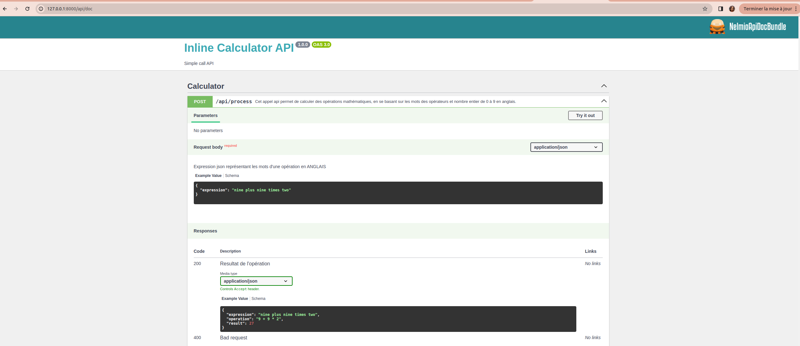

## inline-calculator-api 📟

Cette API propose de faire des opérations mathématiques en se basant sur les mots qui répresentent les opérateurs et les nombres de 0 à 9 (En Anglais)

### Prérequis

 - [Symfony6.4](https://symfony.com/doc/6.4/setup.html)
 - [PHP 8+](https://docs.docker.com/compose/install)

### Installation

### Cloner le repository git

```
$ git clone https://github.com/msolonirina/inline-calculator-api.git 
```

### Lancer le composer install

```
$ cd inline-calculator-api
$ composer install 
```

### NB: Pour le test on va utiliser le cli de symfony
### installation du cli pour simuler notre serveur (Lien documentation [ici](https://symfony.com/download))

 - Linux (Debian/Ubuntu) :

 ```
 $ curl -1sLf 'https://dl.cloudsmith.io/public/symfony/stable/setup.deb.sh' | sudo -E bash
 $ sudo apt install symfony-cli
 ```

 - Mac Os
 ```
 $ brew install symfony-cli/tap/symfony-cli
 ```

 - Windows (Utilisation de scoop)
 ```
 $ scoop install symfony-cli
 ```

### Lancer la commande pour demarrer notre server
```
$ symfony server:start
```

***Si le serveur est démarré on aura l'écran comme suit***


### Pour accéder à la documentation de swagger de l'api 

***Aller sur le navigateur sur l'url du web server et rajouter /api/doc***

### Comme ici [http:://127.0.0.1:8000/api/doc](http:://127.0.0.1:8000/api/doc)

Adapter le port si besoin 

Ci après la page d'accueil de la documentation swagger



### Pour lancer le test unitaire 
```
$ php bin/phpunit
```